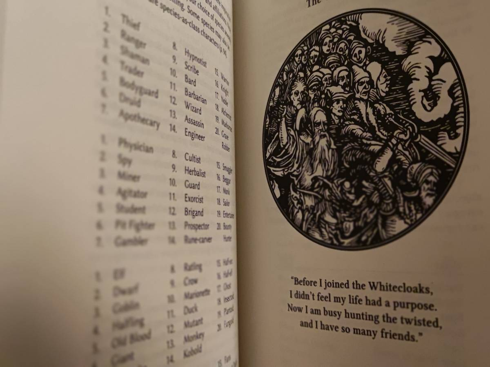
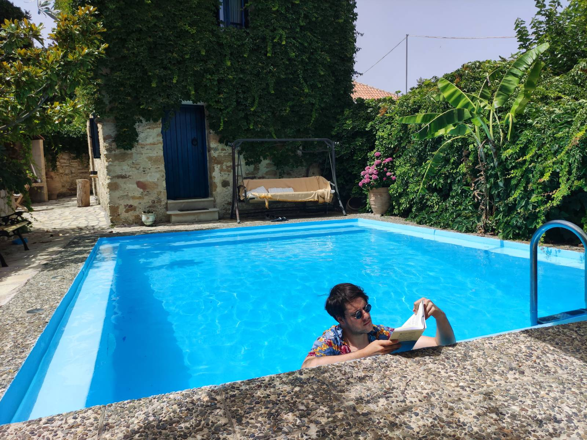

+++
title = "Whitehackers"
description = "From all the OSR/N(u)SR rulesets out there, one particularly grabbed my attention. One day I stumbled upon this amazing post on reddit, and once I realized that the drawings were made by a player inside the spare pages of the core rulebook – which were put there for that exact purpose – my mind exploded, and the one to blame was Whitehack."
[taxonomies]
tags = ["game design", "ttrpg", "review"]
[extra]
ogimage = "../whitehackers.png"
+++

From all the **[OSR](https://en.wikipedia.org/wiki/Old_School_Revival)/[N(u)SR](https://boneboxchant.wordpress.com/2019/12/21/nsr/)** rulesets out there, one particularly grabbed my attention. One day I stumbled upon [this](https://v.redd.it/68c42emolzm41) amazing post on reddit, and once I realized that the drawings were made by a player inside the spare pages of the core rulebook – which were put there for that exact purpose – my mind exploded, and the one to blame was **Whitehack**.

Before going directly to an official product page and buying a copy of the rulebook, I peeked into the Whitehack subreddit and, to my surprise, I saw one of the most creative communities in the OSR/NSR scene (full stop). It was really thrilling to see the amount of creativity coming from the players and referees of the game.
 
*Is it that creatives are attracted to this game or does game itself spark the creativity in one’s mind?*

This was the first question that came to my mind. The only way I could answer it myself was to check what the game actually has to offer.

When it comes to buying a physical copy of the rules, I didn't get the 2nd edition at the time since the 3rd one has already been announced. Instead, I was impatiently waiting for the release of the 3rd edition. And not long after I was holding a single book that is 159 pages shy including the index. And that's it. All the core rules, DM rules and monster manuals are hidden between these pages that are barely bigger than a pocketbook.

## White the hack?

**Whitehack** is without any doubt a *generic role-playing system* that is still OSR compatible if you stretch your grey muscles a bit.

First striking thing that caught my attention was the subtitle at the book dustjacket - *Quality Rules*. What was **Christian Mehrstam** (a.k.a the creator of *Whitehack*) implying with this? Was his intention to point to the undoubtable and increasing need for a quality content in role-playing games? Even though the name itself mentions "hack", I’d rather say it’s a mishmash of good (both general and innovative) ideas than a particular *hack* of a system.

The game is kind of a Talmud itself in its appearance and design goals. Or should I say *"One ring to rule them all"*.

As a software engineer, I couldn't help but notice that the creator probably had a software design approach to game creation. To be more precise, I wouldn't be far off to say that it contains linguistic and/or entity-component based approach of game rules design.
 
For example, the game's character creation has no direct notion of races, classes, and subclasses, but rather uses general concepts such as *wordings*, *groups* and *vocations*. **Groups** are the coolest one and they represent basically anything you want your character to be. Do you want to play **The Strong Giant Treefolk Swordmaster**? You can have it, those are three groups attached to **The Strong** vocation. The **vocation** will give some game mechanics and core fluff to the character, whereas other group wordings (*treefolk*, *giant* and *swordmaster*) come with some advantages and disadvantages plus player-driven flavor to the character. Those bonuses and penalties are meant to be defined by a player with a guidance of a referee based on the common sense. For instance, if someone decides to be a giant, that character is most likely going to be tall and slow, thus adding some minus modifiers to movement and plus modifiers to constitution etc.

This is a perfect example of general **entities** that can have **components** attached to them while using the base linguistic principles of *adjectives* and *nouns*. And all of these combine nicely and make a super generic *system* that can be used for running basically any setting.

Oh, and did I mention that this system scales and applies a similar approach to creating spells, items, monsters and **bases**. Genius, right?

The book contains 6 chapters and one appendix and index. The 6 chapters are split in a meaningful way where each one represents different set of rules and guides with the exception of first *Introduction* chapter, which hooks you into what **Whitehack** actually is and where it is heading with its *quality rules*.                                                    

One particular chapter stands out the most in my opinion – the fifth chapter titled *"How to Run the Game"*. It serves as a Referee guide (DM's guide) of sorts, but I would say it is much more than that. The whole chapter is actually giving some great tips on how to be a Referee, and how to create impressive dungeons, adventures, campaigns and stories. It can serve as an abstract and encapsulated tool for worldbuilding, regardless of whether you’re into RPGs or not. This sole chapter is a good enough purchase reason if you are into game design, worldbuilding or fiction writing.

For example, at one point in the chapter there is a graph/flowchart that shows *"Mapping Phases"* which portrays how to map out adventure phases so that there is no need for heavy brainstorming of all the different outcomes that are possible within an adventure. All the phases are represented as nodes that are linked with bi-directional paths. Each link has an abstract action name (*task*, *knowledge*, *item* etc.) that indicates what the characters of the adventure should attend to. The chapter features several similar diagrams that are both abstract and pretty useful. This is pure software engineering stuff, right?

## Goosebumps

><em>While the rules provide structure and means of resolution, their main purpose isn’t to help. Children learn to make things up together long before they can read, playing games of make-believe. You may need a reminder, but you don’t need written rules for that.</em>

><em>**Christian Mehrstam** (2021), *Whitehack Third Edition*, Chapter V p.104</em>

The game also utilizes (only if needed) some procedural content generation. One that particularly comes to my mind is a miracle (spells) generation, that’s titled in the book as *Miracle Wording Oracle*. Basically, this feature allows you to create new interesting spells with rolling a few **d20s** and following the provided table. In my case it turned out to be **The Speaking Orb of the Death Servant** and thus I created a magical orb with player driven plot hook at its name. As to how powerful a miracle can be, the chapter includes a useful table as a toolkit for spell stats and related game mechanics.

When it comes to dungeon design principles (recipes) showcased in the 5th chapter, I’d imagine even great designers such as the ones that made *Gloomhaven* would be envious. It’s the ultimate go-to tool for creating gripping and addicting dungeons that players would want to explore.

Monster creator in the 6th chapter is another fun exercise for when you are out of monster ideas regardless of the game you’re playing. In the chapter you can also find a good guide for defining boss monsters (as a DM I usually suck at creating those and end up creating overpowered NPCs).
 
Each chapter also features at least one or two paragraphs on how to convert or import the adventures, monsters, and spells from the "other games" and/or other old school extravaganza.

Appendix features mind-blowing easter egg adventure that is actually an exercise for what you learned in the previous chapters. It is a great tool for checking if the reader is utilizing the tools provided in the book and therefore *generating* an amazing adventure.

>><em>Whitehacking from the pool</em>

## Finale

Suffice to say I have my answer. This game is a toolbox that both creatives and non-creatives can utilize for giving birth to new stories, worlds and systems. It undoubtedly has more than enough imaginative spark for anyone that’s searching for it. When in right hands and imaginative mind, **Whitehack** helps you create those awesome filled pages that I've mentioned in beginning.

If you want to buy the game go to [this page](https://whitehackrpg.wordpress.com/buy/). There are a couple of different "variations" of the printed products (at least at the time I’m writing this). All of them contain the same rules, but the book format is different. For example, the "Notebook Edition" contains those awesome empty spare pages that are to be filled by a player or a Referee.

There is also a digital *phone-friendly* version which has the price of (again, at the time of writing this) a single [*Chessex d20*](http://www.chessex.com/) dice set. Just to be clear, the smartphone and that one version is all you need to play this amazing game, since there are plenty of free d20 dice apps out there. All in all, the game is really accessible and there is something to look forward to for everyone.

 

That’s it for now. Next up is the other ...*hack* from the dark side of the Force. **Blackhack**