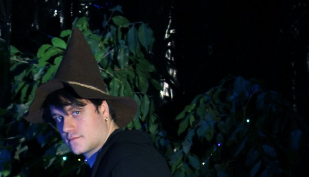

+++
date = "1993-01-06"
[extra]
+++

## Hi, I am Stefan Mijucic
I am a computer graphics engineer by training that got into web development. Most of all, I enjoy writing clean code and mastering the art of writing software. In my free time, I study [**game development**](https://fanna.itch.io/), low-level programming and lately game design. When not programming, I am usually playing video or board games, am deep into reading some fantasy book or worldbuidling my campaign setting. I also make some [**indie music**](https://nebonadberlinom.bandcamp.com/releases). 

I used to work in startups such as [**Semaphore**](https://semaphoreci.com/) and [**Vectary**](https://www.vectary.com/). Currently I am working as a software consultant on various projects that range from 3D visualisation to full-stack web app creation.

☮[**Twitter**](https://twitter.com/fannasm)

☮[**LinkedIn**](https://www.linkedin.com/in/stefan-mijucic-981392bb/)

☮[**Github**](https://github.com/fanna)
